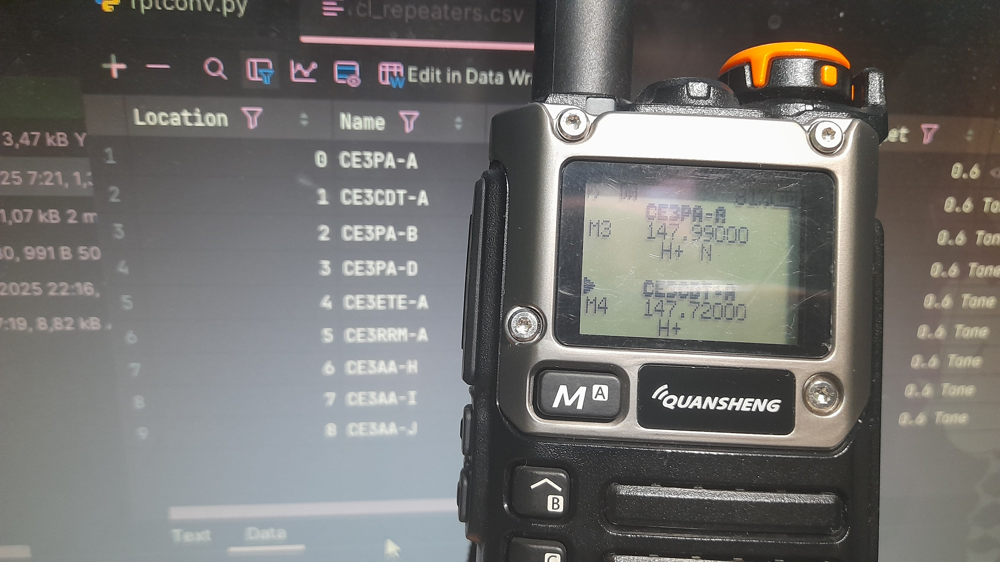

# RPTConv [![Patreon][patreon-img]][patreon-url] [![PayPal][paypal-img]][paypal-url] [![Discord][discord-img]][discord-url]

> WARNING: The SUBTEL excel file is most of the time wrong about frequencies, tones and coordinates, please use at your own risk

RPTConv is a simple Python script to convert the Amateur Radio Repeaters List provided by SUBTEL (Undersecretary of Telecommunications - Chile) into CHIRP compatible lists. It allows you to filter by region, sort by distance and export specific bands.

## Download

`git clone https://github.com/justalemon/RPTConv.git`

## Installation

* Arch Linux: Use `makepkg -sif` to install the provided PKGBUILD
* Debian/Ubuntu and Derivatives: Install [makedeb](https://www.makedeb.org) and use `makedeb -si` to install the provided PKGBUILD
* Other: Install Python 3 and pip in your system, install the requirements with `pip install -r requirements.txt` and run te Python file

## Usage

Use `rptconv` or `python3 rptconv` to run the program. You can use `--help` to see which parameters are available for you to use.

[patreon-img]: https://img.shields.io/badge/support-patreon-FF424D.svg
[patreon-url]: https://www.patreon.com/lemonchan
[paypal-img]: https://img.shields.io/badge/support-paypal-0079C1.svg
[paypal-url]: https://paypal.me/justalemon
[discord-img]: https://img.shields.io/badge/discord-join-7289DA.svg
[discord-url]: https://discord.gg/Cf6sspj
